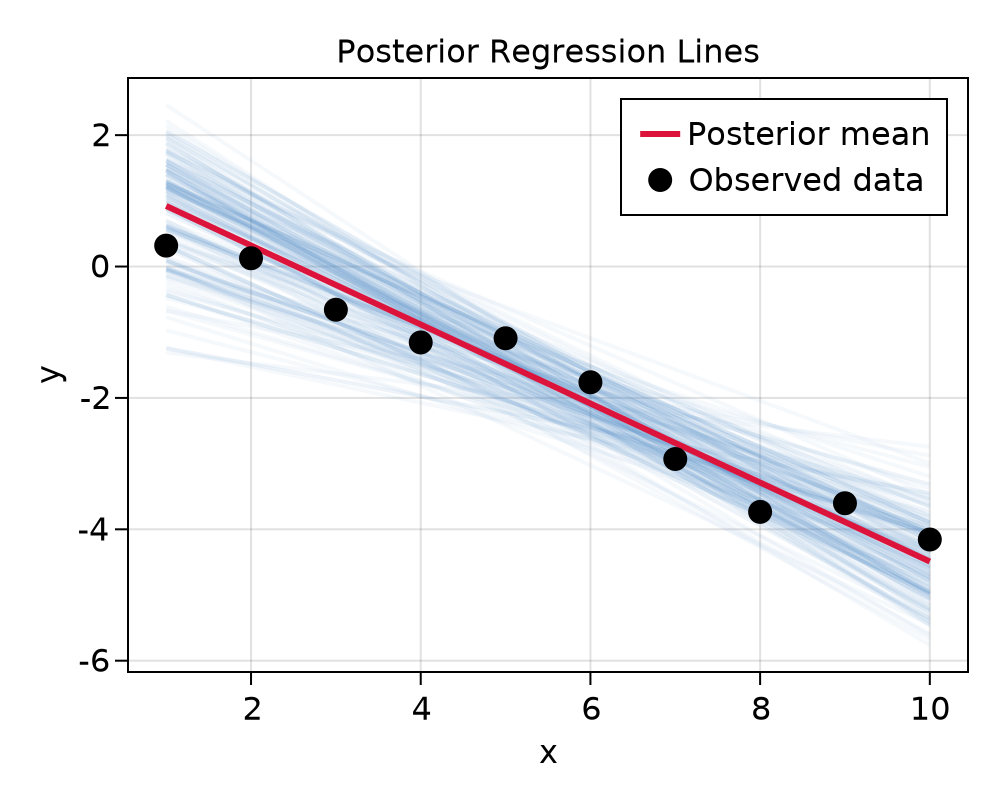
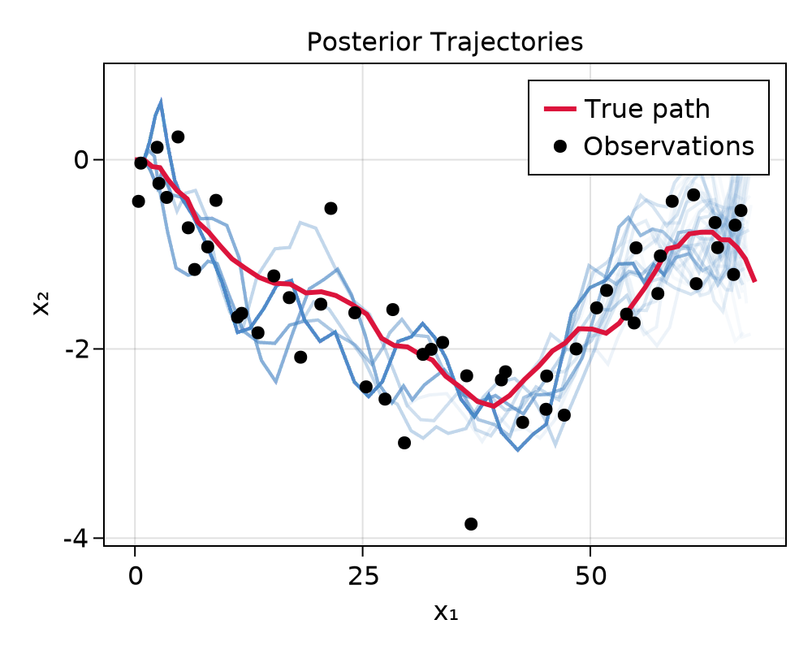

# WeightedSampling.jl

[](https://github.com/MariusFurter/WeightedSampling.jl/actions/workflows/CI.yml?query=branch%3Amain)

**WeightedSampling.jl** provides a macro-based interface for Sequential Monte Carlo (SMC) in Julia. The `@model` macro compiles probabilistic programs into particle-transformer programs that run on an `SMCState`.

**Features:**

- Intuitive `@model` macro for SMC model specification
- Automatic weight management and resampling
- Support for Metropolis-Hastings moves within SMC
- Flexible kernel and proposal definitions
- Utility functions for particle analysis and sampling

**Note:** This package is in early development. Use with caution. Feedback is welcome!

## Installation

This package is not yet registered. Install directly from GitHub:

```julia
using Pkg
Pkg.add("https://github.com/MariusFurter/WeightedSampling.jl")
```

## Quick Start

For detailed information, see the [`documentation`](https://MariusFurter.github.io/WeightedSampling.jl). Additional examples are available in [`/examples/`](examples/).

### Linear Regression with MH Moves

```julia
using WeightedSampling
using Random

Random.seed!(42)

@model function linear_regression(xs, ys)
    α ~ Normal(0.0, 10.0)
    β ~ Normal(0.0, 10.0)
    for (x, y) in zip(xs, ys)
        y => Normal(α + β * x, 1.0)
        if resampled
            α << autoRW()
            β << autoRW()
        end
    end
end

xs = 1:10
ys = 1.0 .- 0.5 .* xs .+ 0.5 .* randn(length(xs))

model = linear_regression(xs, ys)
state = SMCState(1_000)
run!(model, state)

describe(state)
posterior_mean_alpha = @E(α -> α, state)
```
<div align="center">
  
</div>

### Bootstrap Particle Filter

```julia
using WeightedSampling

@model function ssm(obs)
    I = [1.0 0.0; 0.0 1.0]
    x{1} .= [0.0, 0.0]
    v .= [1.0, 0.0]
    for (i, o) in enumerate(obs)
        x{i + 1} .= x{i} + v
        dv ~ MvNormal([0.0, 0.0], 0.1 * I)
        v .= v + dv
        o => MvNormal(x{i + 1}, 0.5 * I)
    end
end

obs = [[0.0, 0.0], [1.0, -0.2], [2.0, 0.1]]
state = SMCState(500)
run!(ssm(obs), state)
```

<div align="center">
  
</div>


## The `@model` Macro

The core of **WeightedSampling.jl** is the `@model` macro, which transforms a Julia function into a Sequential Monte Carlo (SMC) model with automatic weight management, resampling, and support for Metropolis-Hastings (MH) moves. This enables concise and expressive probabilistic programming.

- **Particle assignment:** `x .= expr` broadcasts `expr` to all particles.
- **Sampling:** `x ~ Distribution(args)` (or custom kernel name) samples and updates particle weights.
- **Observation:** `expr => Distribution(args)` conditions on observed data, updating weights accordingly.
- **MH Move:** `x << Proposal(args)` applies Metropolis-Hastings moves to particles.

SMC models defined with `@model` are compiled to a function that builds a `ParticleTransformer`.
Typical usage:

- `model = model_name(args...)`
- `state = SMCState(n_particles)`
- `run!(model, state)`

This gives you explicit control over execution state, resampling behavior, and diagnostics.

## Utility Functions

The package also provides utility functions for working with weighted samples.

- `sample(state, n; replace=false)` — Draw `n` weighted samples from the particle state.
- `describe(state)` — Summary statistics of particle variables.
- `exp_norm(weights)` — Convert log-weights to normalized probabilities.
- `@E(f, state)` — Compute weighted expectations over particle variables.


