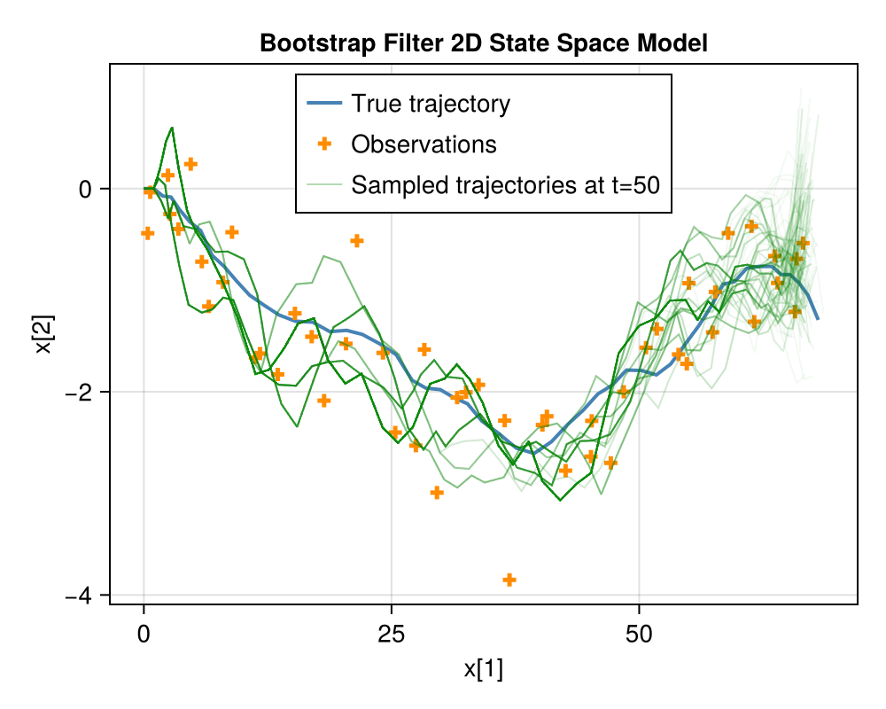

# WeightedSampling.jl

[](https://github.com/MariusFurter/WeightedSampling.jl/actions/workflows/CI.yml?query=branch%3Amain)

**WeightedSampling.jl** provides a macro-based interface for Sequential Monte Carlo (SMC) in Julia. It enables concise, readable probabilistic programs that are transformed into efficient particle filters with resampling and weight management.

## Features

- Intuitive `@smc` macro for SMC model specification
- Automatic weight management and resampling
- Support for Metropolis-Hastings moves within SMC
- Flexible kernel and proposal definitions
- Utility functions for particle analysis and sampling

## Installation

This package is not yet registered. Install directly from GitHub:

```julia
using Pkg
Pkg.add("https://github.com/MariusFurter/WeightedSampling.jl")
```

## Quick Start

For detailed information, see the [`Usage Guide`](docs/usage_guide.md). Additional examples are available in [`/examples/`](examples/). 

### Linear Regression with MH Moves

```julia
using WeightedSampling

@smc function linear_regression_move(xs, ys)
    α ~ Normal(0, 10) # sample
    β ~ Normal(0, 10)

    for (x, y) in zip(xs, ys)
        y => Normal(α + β * x, 1.0) # observe
        if resampled
            (α, β) << autoRW() # move
        end
    end
end

particles, evidence = linear_regression(xs, ys, n_particles=1000, ess_perc_min=0.5)
describe_particles(particles)
```
<div align="center">
  
</div>

### Bootstrap Particle Filter

```julia
@smc function ssm(observations)
    I = [1 0; 0 1]  # local variable
    x .= [0.0, 0.0] # assign
    v .= [1.0, 0.0]
    for obs in observations
        x .= x + v
        dv ~ MvNormal([0,0], 0.1*I) # sample
        v .= v + dv
        obs => MvNormal(x, 0.5*I) # observe
    end
end

particles, evidence = ssm(observations, n_particles=1_000)
describe_particles(particles)
```

<div align="center">
  
</div>


## The `@smc` Macro

The core of **WeightedSampling.jl** is the `@smc` macro, which transforms a Julia function into a Sequential Monte Carlo (SMC) model with automatic weight management, resampling, and support for Metropolis-Hastings (MH) moves. This enables concise and expressive probabilistic programming.

- **Particle assignment:** `x .= expr` broadcasts `expr` to all particles.
- **Sampling:** `x ~ SMCKernel(args)` samples from a distribution or kernel and updates particle weights.
- **Observation:** `expr => SMCKernel(args)` conditions on observed data, updating weights accordingly.
- **MCMC Move:** `x << Proposal(args)` applies MH moves to particles.

SMC models defined with `@smc` are compiled to two main functions:
- `model!(args...; particles, ...)` *(in-place update of existing particles)*
- `model(args...; n_particles=..., ...)` *(creates and returns new particles)*

These functions allow you to run SMC inference with customizable settings for particle count, resampling strategy, and effective sample size thresholds.

## Utility Functions

The package also provides utility functions for working with weighted samples.

- `sample_particles(particles, n; replace=false)` — Draw `n` samples from the particle set, according to weights.
- `describe_particles(particles)` — Summary statistics of particle variables.
- `exp_norm(weights)` — Convert log-weights to normalized probabilities.
- `@E(f, particles)` — Compute the weighted expectation of a function `f` over the particle variables.

---

**Note:** This package is in early development. Feedback is welcome!

